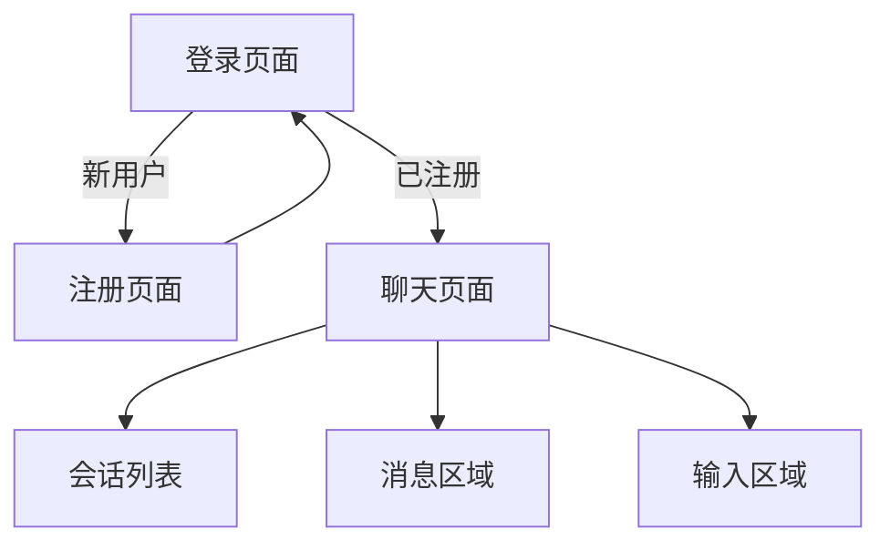

## 1. Product Overview
企业级AI应用平台的用户认证与即时通讯系统。提供安全可靠的登录注册功能，以及高效的实时聊天体验。
- 目标用户：企业管理员、普通员工
- 核心价值：便捷的用户认证、灵活的权限管理、可靠的即时通讯

## 2. Core Features

### 2.1 User Roles
| Role | Registration Method | Core Permissions |
|------|---------------------|------------------|
| Admin | 系统初始化创建 | 用户管理、系统配置、数据导出 |
| User | 邮箱/手机号注册 | 聊天功能、个人资料管理 |

### 2.2 Feature Module
认证与聊天系统包含以下核心页面：
1. **登录页面**：支持邮箱/手机号登录，密码输入，忘记密码
2. **注册页面**：用户信息填写，短信验证，协议确认
3. **聊天页面**：消息列表，实时通讯，会话管理

### 2.3 Page Details
| Page Name | Module Name | Feature description |
|-----------|-------------|---------------------|
| 登录页面 | 登录表单 | 支持邮箱/手机号切换输入，实时格式验证 |
| 登录页面 | 密码输入 | 密码可见性切换，强度提示 |
| 登录页面 | 登录按钮 | 加载状态显示，错误处理 |
| 登录页面 | 忘记密码 | 跳转至密码重置流程 |
| 注册页面 | 用户信息 | 用户名4-20位，实时可用性检查 |
| 注册页面 | 手机号验证 | 11位手机号，60秒重发限制 |
| 注册页面 | 密码设置 | 8-20位，大小写+特殊字符要求 |
| 注册页面 | 协议确认 | 两个必选协议，独立checkbox |
| 聊天页面 | 会话列表 | 左侧边栏显示历史会话 |
| 聊天页面 | 消息区域 | 消息气泡，状态指示，虚拟滚动 |
| 聊天页面 | 输入区域 | 文本输入，@提及，发送控制 |

## 3. Core Process
用户操作流程：
1. 新用户访问注册页面 → 填写信息 → 验证手机号 → 同意协议 → 注册成功
2. 注册用户访问登录页面 → 输入凭证 → 验证登录 → 进入聊天页面
3. 聊天页面 → 选择会话 → 发送消息 → 实时通讯

## 4. User Interface Design

### 4.1 Design Style
- **主色调**：深蓝色 #1E40AF（企业级配色）
- **辅助色**：深灰色 #374151，金色 #D4AF37
- **按钮样式**：圆角 8px，纯色背景，无渐变
- **字体**：系统默认无衬线字体，标题16-18px，正文14px
- **布局**：卡片式布局，左右分栏结构
- **图标**：使用Lucide React图标库，禁止使用Emoji

### 4.2 Page Design Overview
| Page Name | Module Name | UI Elements |
|-----------|-------------|-------------|
| 登录页面 | 品牌区域 | 蓝色方块图标(#1677FF)，品牌名"和元智擎"，标语灰色文字 |
| 登录页面 | 表单区域 | 白色卡片，圆角8px，输入框浅色边框(#E6EAF0) |
| 聊天页面 | 顶部栏 | 深色标题，管理员标识，操作图标 |
| 聊天页面 | 消息气泡 | 蓝色背景(#E8F3FF)，圆角设计，状态图标 |
| 聊天页面 | 输入栏 | 圆角输入框，发送按钮，底部提示文字 |

### 4.3 Responsiveness
- **设计原则**：桌面端优先，移动端适配
- **响应式断点**：768px（平板），1024px（桌面）
- **触摸优化**：移动端增大点击区域，支持