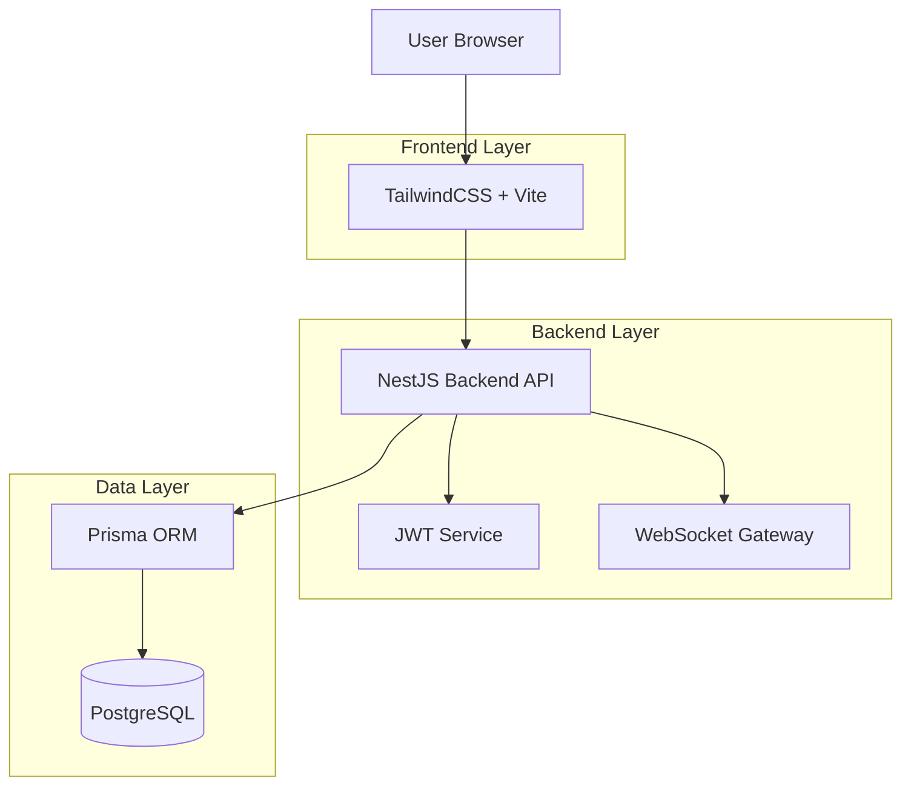
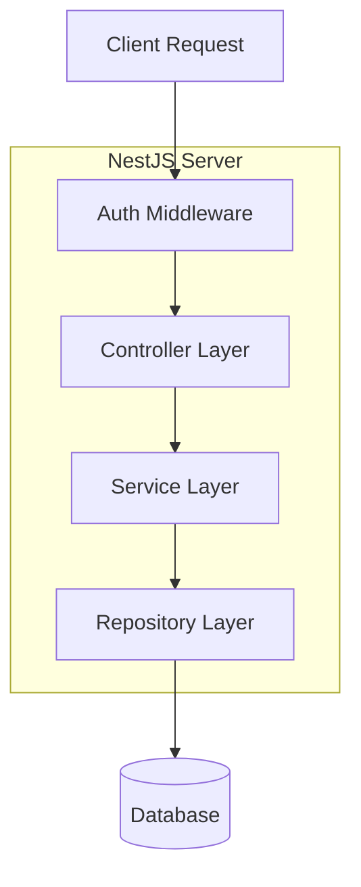
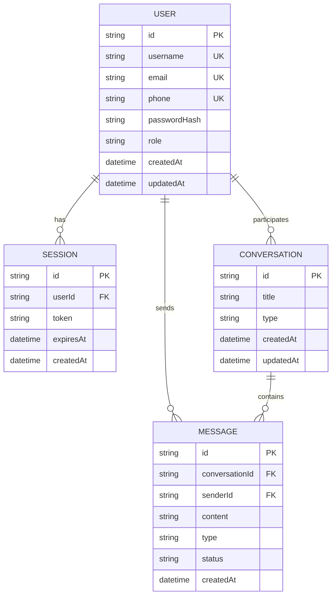

## 1. Architecture design



## 2. Technology Description
- **Frontend**: React@18 + TypeScript + TailwindCSS@3 + Vite
- **Initialization Tool**: vite-init
- **Backend**: NestJS@10 + TypeScript + Prisma@5
- **Database**: PostgreSQL (via Prisma)
- **Authentication**: JWT + bcrypt
- **Real-time**: WebSocket (Socket.io)
- **Validation**: class-validator + class-transformer

## 3. Route definitions
| Route | Purpose |
|-------|---------|
| /login | 用户登录页面 |
| /register | 用户注册页面 |
| /chat | 聊天主页面 |
| /forgot-password | 密码重置页面 |
| /terms | 用户协议页面 |
| /privacy | 隐私政策页面 |

## 4. API definitions

### 4.1 Authentication APIs

**用户注册**
```
POST /api/auth/register
```

Request:
| Param Name | Param Type | isRequired | Description |
|------------|-------------|-------------|-------------|
| username | string | true | 用户名，4-20位字符 |
| email | string | true | 邮箱地址 |
| phone | string | true | 手机号，11位 |
| password | string | true | 密码，8-20位 |
| verificationCode | string | true | 6位短信验证码 |

Response:
| Param Name | Param Type | Description |
|------------|-------------|-------------|
| success | boolean | 注册状态 |
| message | string | 提示信息 |
| token | string | JWT令牌 |

**用户登录**
```
POST /api/auth/login
```

Request:
| Param Name | Param Type | isRequired | Description |
|------------|-------------|-------------|-------------|
| identifier | string | true | 邮箱或手机号 |
| password | string | true | 密码 |

Response:
| Param Name | Param Type | Description |
|------------|-------------|-------------|
| success | boolean | 登录状态 |
| token | string | JWT令牌 |
| user | object | 用户信息 |

**发送验证码**
```
POST /api/auth/send-sms
```

Request:
| Param Name | Param Type | isRequired | Description |
|------------|-------------|-------------|-------------|
| phone | string | true | 手机号 |

### 4.2 Chat APIs

**获取会话列表**
```
GET /api/chat/conversations
```

**发送消息**
```
POST /api/chat/messages
```

Request:
| Param Name | Param Type | isRequired | Description |
|------------|-------------|-------------|-------------|
| conversationId | string | true | 会话ID |
| content | string | true | 消息内容 |
| type | string | true | 消息类型(text/image) |

## 5. Server architecture diagram



## 6. Data model

### 6.1 Data model definition



### 6.2 Data Definition Language

**用户表**
```sql
CREATE TABLE users (
  id UUID PRIMARY KEY DEFAULT gen_random_uuid(),
  username VARCHAR(20) UNIQUE NOT NULL,
  email VARCHAR(255) UNIQUE NOT NULL,
  phone VARCHAR(11) UNIQUE NOT NULL,
  password_hash VARCHAR(255) NOT NULL,
  role VARCHAR(20) DEFAULT 'user' CHECK (role IN ('admin', 'user')),
  created_at TIMESTAMP WITH TIME ZONE DEFAULT NOW(),
  updated_at TIMESTAMP WITH TIME ZONE DEFAULT NOW()
);

CREATE INDEX idx_users_username ON users(username);
CREATE INDEX idx_users_email ON users(email);
CREATE INDEX idx_users_phone ON users(phone);
```

**会话表**
```sql
CREATE TABLE sessions (
  id UUID PRIMARY KEY DEFAULT gen_random_uuid(),
  user_id UUID REFERENCES users(id) ON DELETE CASCADE,
  token VARCHAR(500) UNIQUE NOT NULL,
  expires_at TIMESTAMP WITH TIME ZONE NOT NULL,
  created_at TIMESTAMP WITH TIME ZONE DEFAULT NOW()
);

CREATE INDEX idx_sessions_user_id ON sessions(user_id);
CREATE INDEX idx_sessions_token ON sessions(token);
```

**对话表**
```sql
CREATE TABLE conversations (
  id UUID PRIMARY KEY DEFAULT gen_random_uuid(),
  title VARCHAR(255) NOT NULL,
  type VARCHAR(20) DEFAULT 'private' CHECK (type IN ('private', 'group')),
  created_at TIMESTAMP WITH TIME ZONE DEFAULT NOW(),
  updated_at TIMESTAMP WITH TIME ZONE DEFAULT NOW()
);
```

**消息表**
```sql
CREATE TABLE messages (
  id UUID PRIMARY KEY DEFAULT gen_random_uuid(),
  conversation_id UUID REFERENCES conversations(id) ON DELETE CASCADE,
  sender_id UUID REFERENCES users(id) ON DELETE CASCADE,
  content TEXT NOT NULL,
  type VARCHAR(20) DEFAULT 'text' CHECK (type IN ('text', 'image', 'file')),
  status VARCHAR(20) DEFAULT 'sent' CHECK (status IN ('sending', 'sent', 'delivered', 'read')),
  created_at TIMESTAMP WITH TIME ZONE DEFAULT NOW()
);

CREATE INDEX idx_messages_conversation_id ON messages(conversation_id);
CREATE INDEX idx_messages_sender_id ON messages(sender_id);
CREATE INDEX idx_messages_created_at ON messages(created_at);
